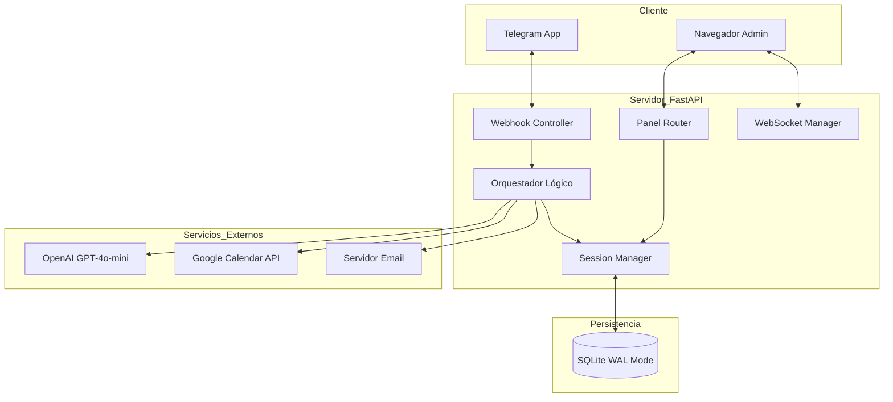
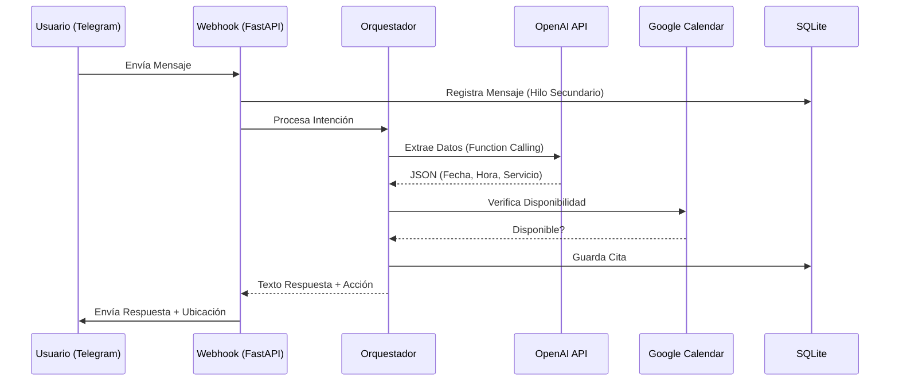
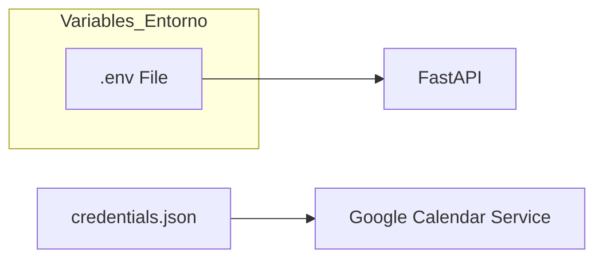

# Manual Técnico Detallado - Chatbot SEPROA

Este documento proporciona una visión profunda de la arquitectura, flujos de datos y configuración del ecosistema SEPROA.

## 1. Arquitectura del Sistema

El sistema utiliza una arquitectura modular basada en microservicios lógicos integrados en un núcleo de FastAPI.

### Diagrama de Arquitectura (Mermaid)

## 2. Flujos de Datos

### A. Flujo de Mensaje de Usuario (Agendamiento)
1. **Entrada:** Telegram envía un POST al Webhook.
2. **Registro:** El sistema registra al usuario y el mensaje en un hilo secundario (Thread).
3. **Caché:** Se recupera el contexto del sistema desde la RAM.
4. **Procesamiento:** El Orquestador llama a OpenAI para extraer intenciones.
5. **Validación:** Se consultan horarios en SQLite y disponibilidad en Google Calendar.
6. **Respuesta:** Se envía el mensaje a Telegram y se actualiza el Panel vía WebSocket/Polling.

### Diagrama de Flujo de Datos

## 3. APIs Utilizadas

- **Telegram Bot API:** Gestión de mensajes entrantes/salientes, envío de ubicaciones y acciones de chat (typing).
- **OpenAI API (GPT-4o-mini):** Motor de lenguaje natural para respuestas generales y extracción de datos estructurados mediante *Tools/Functions*.
- **Google Calendar API v3:** Sincronización en tiempo real de la agenda corporativa y validación de disponibilidad.
- **Marked.js (Frontend):** Renderizado de Markdown en el panel administrativo.

## 4. Configuración del Entorno de Desarrollo

### Requisitos Previos
- Python 3.10+
- Credenciales de Google (Service Account JSON)
- Token de Telegram Bot
- API Key de OpenAI

### Diagrama de Configuración

### Pasos de Instalación
1. Clonar el repositorio.
2. Crear un entorno virtual: `python -m venv venv`.
3. Instalar dependencias: `pip install -r requirements.txt`.
4. Configurar el archivo `.env` con los tokens correspondientes.
5. Ejecutar: `uvicorn main:app --reload`.

## 5. Optimizaciones de Concurrencia
El sistema está diseñado para manejar múltiples usuarios simultáneamente incluso en hardware limitado:
- **SQLite WAL:** Evita bloqueos de lectura durante la escritura.
- **Multithreading:** Las tareas de DB no detienen el tráfico de red.
- **Stateless AI:** La base de datos se libera totalmente mientras la IA genera respuestas.
